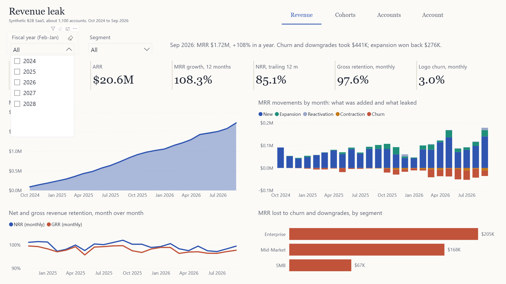

# SaaS Revenue Leak

A B2B SaaS revenue analytics engine built so it can be graded. Five revenue leaks were planted in a simulated business and sealed away; the warehouse, the anomaly monitor and the churn model had to find them blind. Python simulation, dbt on DuckDB with a Kimball star schema, a churn model, and a Power BI report generated entirely from code.

**[Read the case study (PDF)](docs/case-study.pdf)**, or the [web version](docs/case-study.html).
Reviewing the code? Start with **[How it works](docs/how-it-works.pdf)**, a stage-by-stage guide with the design choices worth challenging.



## Results

| | |
|---|---|
| Planted leaks found by the monitor | 5 of 5 on the main run; 19 of 20 across four simulated worlds |
| False alarms | 3 on the main run (10 before the detectors were rebuilt as statistical tests) |
| Churn early warning | 44% of churns flagged in the 60 days before, median 41 days ahead |
| Churn model, out of time | ROC AUC 0.73, the riskiest 10% churn at 2.9x the base rate |
| Injected data problems | 13 of 13 types caught by tests (39,161 dirty rows) |

The monitor was revised once after the first scored run. Because that makes the main run unfit to judge it, both versions were rerun on three worlds nobody had looked at: [detector revisions](docs/detector_revisions.md).

## What it answers

| Question | Where |
|---|---|
| How much recurring revenue do we have, and is it growing? | Revenue: MRR, ARR, 12-month growth |
| Where did revenue come from and where did it leak, month by month? | Revenue: New, Expansion, Reactivation, Contraction, Churn |
| Are we keeping the revenue we have? | Revenue: NRR and GRR, monthly and trailing 12 months |
| Which signup cohorts stay, and which do not? | Cohorts: retention heatmap by month since signup |
| Is the product being used? | Cohorts: weekly active users, sessions and feature use per account |
| Who should customer success call this week, and why? | Accounts: model risk x health matrix, top-8 call list with reasons |
| Is something leaking right now? | Accounts: the revenue leak monitor's latest alerts |
| What is going on with this one customer? | Account: MRR history, usage, health, billing ledger, tickets |

## How it is built

```
generator/        day-by-day simulation, planted incidents, injected data problems, sealed answer key
dbt/              staging -> intermediate -> star schema (contracts enforced) -> metrics and monitor
ml/               60-day churn model, out-of-time test, per-account drivers
scripts/          Power BI exports, mutation test
powerbi/          PBIP generator (TMDL model + PBIR report), report checks
scorecard/        the only code that reads the answer key; multi-seed reruns
docs/             case study and guide (rendered from the warehouse), charts, report images
```

| Layer | What is in it |
|---|---|
| Star schema | `fact_mrr_movements` (daily MRR ledger), `fact_product_usage` (daily and weekly), `fact_support_tickets` (SLAs), `dim_customers` (SCD Type 2 on account manager, tier, size and ARR band), `dim_date` (fiscal calendar) |
| Metrics | MRR waterfall, NRR and GRR (monthly and trailing 12 months), cohort retention, weekly health score, six-detector revenue leak monitor |
| Model | logistic regression and XGBoost on weekly snapshots; trained to Dec 2025, tested Mar-Aug 2026 |
| Report | four pages, 13 tables, 12 relationships, 66 measures, all generated by `powerbi/build_pbip.py` |

## Run it

```
pip install -r requirements.txt
python pipeline.py
```

That simulates the data, builds and tests the warehouse, trains and scores the model, writes the Power BI project and its data, and grades everything against the answer key (about 45 seconds). Then open `powerbi/RevenueLeak.pbip` in Power BI Desktop and press **Refresh**.

## How it is proved

| Check | Result |
|---|---|
| dbt build: tests and enforced contracts | 105 nodes, 0 errors; 8 warn-level tests fire, one per class of injected mess |
| Mutation test (`scripts/mutation_test.py`) | 14 of 14 deliberate breakages caught |
| Report numbers vs DuckDB (`powerbi/check_report.py`) | 66 of 66 measures evaluate; 69 of 69 figures match |
| Nothing truncated (`powerbi/check_fit.py`) | 3,391 of 3,391 text lines fit; 8 of 8 tables without scrollbars |
| Determinism | two runs from scratch: 90 of 90 output files byte-identical |
| CI | GitHub Actions reruns the pipeline and the mutation test on every push |

## Limits

The data is simulated: the results show how well the analytics find what was planted, not how a real company behaves. Incident dates are the same in every world. The account-manager detector finds a neglected book months late, and the rules-based health score catches far less churn than the model. Power BI has no free public link, so the report ships as a project with images in the docs.
